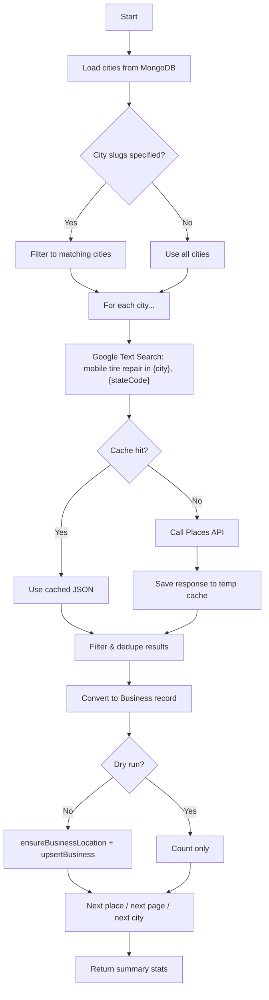

# Google Places Fetcher — User Manual

The Google Places fetcher searches Google’s **Places API (New)** for mobile tire repair businesses in your target cities and saves them directly to MongoDB. You can run it from the **admin UI** or the **command line**.

---

## What it does (in one sentence)

For each city in your database, it runs a Google search like *“mobile tire repair in Dallas, TX”*, filters the results, converts them into business records, and **creates or updates** them in MongoDB.

---

## Prerequisites

Before running a fetch, you need:

| Requirement | Details |
|---|---|
| **Google Maps API key** | Set `GOOGLE_MAPS_API_KEY` in `.env.local` |
| **Places API (New) enabled** | In [Google Cloud Console](https://console.cloud.google.com/) → APIs & Services → enable **Places API (New)** (not the legacy Places API) |
| **Billing enabled** | Google charges per Text Search request |
| **MongoDB** | `MONGODB_URI` must be set and reachable |
| **Cities in the database** | The fetcher reads cities from MongoDB — add them first at `/admin/cities` |

If no cities exist, the fetch fails with: *“No cities in database — add cities in admin first”*.

---

## Recommended workflow

1. **Add cities** at `/admin/cities` (slug, name, state, state code, etc.).
2. **Log in** to admin at `/admin/login`.
3. **Dry run first** — preview results without writing to the database.
4. **Fetch & save** when the preview looks good.
5. **Review** businesses at `/admin/businesses` and edit as needed.

---

## Method 1: Admin UI (easiest)

Go to **`/admin/businesses`**. At the top you’ll see the **“Fetch from Google Places”** panel.

### Fields

| Field | What it does |
|---|---|
| **City slugs (optional)** | Comma-separated slugs, e.g. `dallas, houston`. Leave empty to fetch **all** cities in the database. |
| **Pages per city** | How many result pages to request per city (1 = up to ~20, 2 = ~40, 3 = ~60). |
| **Dry run** | When checked, fetches and shows stats but **does not write** to MongoDB. |

### Buttons

- **Preview fetch** (dry run on) — safe test run
- **Fetch & save to database** (dry run off) — writes to MongoDB

### After a successful fetch

You’ll see:

- Total businesses found
- Created vs updated counts
- API calls vs cache hits
- Per-city breakdown (e.g. `Dallas, TX: 12`)

The business list refreshes automatically after a non–dry-run fetch.

---

## Method 2: Command line

From the project root:

```bash
npm run fetch:businesses
```

### CLI flags

| Flag | Example | Description |
|---|---|---|
| `--cities` | `--cities dallas,houston` | Limit to specific city slugs |
| `--pages` | `--pages 2` | Pages per city (1–3, default `1`) |
| `--dry-run` | `--dry-run` | Preview only, no DB writes |
| `--no-cache` | `--no-cache` | Force fresh API calls (ignore cache) |

### Examples

```bash
# All cities, 1 page each
npm run fetch:businesses

# Specific cities only
npx tsx scripts/fetch-businesses.ts --cities dallas,houston

# More results per city
npx tsx scripts/fetch-businesses.ts --pages 3

# Preview without saving
npx tsx scripts/fetch-businesses.ts --dry-run

# Force fresh Google API calls
npx tsx scripts/fetch-businesses.ts --no-cache
```

The CLI loads env from `.env.local` and `.env` automatically.

---

## Method 3: HTTP API (programmatic)

**Endpoint:** `POST /api/admin/businesses/fetch`  
**Auth:** Requires an admin session cookie (same as other `/api/admin/*` routes).

**Request body (JSON):**

```json
{
  "cities": "dallas,houston",
  "citySlugs": ["dallas", "houston"],
  "maxPages": 2,
  "useCache": true,
  "dryRun": false
}
```

- Use either `cities` (comma-separated string) or `citySlugs` (array).
- Omit both to fetch all cities.

**Success response:**

```json
{
  "success": true,
  "dryRun": false,
  "citiesProcessed": 2,
  "businessesFound": 24,
  "created": 18,
  "updated": 6,
  "apiCalls": 2,
  "cacheHits": 0,
  "cityResults": [
    { "city": "Dallas", "stateCode": "TX", "count": 12 },
    { "city": "Houston", "stateCode": "TX", "count": 12 }
  ]
}
```

---

## How it works internally



### Search query

For each city, the query is always:

```
mobile tire repair in {city.name}, {city.stateCode}
```

Example: `mobile tire repair in Dallas, TX`

### Relevance filter

A place is **kept** only if all of these are true:

1. **Operational** — `businessStatus` is `OPERATIONAL` (or missing)
2. **Has a phone** — national or international number present
3. **Tire/mobile related** — name or types match patterns like:
   - Name contains `tire`, `tyre`, or `mobile`
   - Types include `tire`, `car_repair`, or `auto`

### Deduplication

Places are deduplicated by Google Place ID across all cities in one run. The same business won’t be inserted twice.

### Pagination

- Up to **3 pages** per city (hard cap)
- **2 second delay** between pages (Google requirement for `nextPageToken`)
- Each page returns up to ~20 results

---

## What gets saved for each business

| Field | Source |
|---|---|
| `id` | `g-{googlePlaceId}` |
| `slug` | Generated from name + city slug + state code |
| `name`, `phone`, `address` | Google Places |
| `phoneDisplay` | National phone format from Google |
| `city`, `state`, `stateCode` | From the city being searched |
| `services` | Inferred from name (always includes `mobile-tire-repair`, `flat-tire-repair`; may add `tire-installation`) |
| `areasServed` | `[city.name]` |
| `description` | Auto-generated template text |
| `rating`, `reviewCount` | Google |
| `website` | Google (if available) |
| `hours` | Google opening hours (if available). **24/7** places are encoded by Google as a single period with `open` at Sunday 00:00 and **no** `close` field — we map that to every day `00:00–23:59`. |

### Hours repair

If an earlier import showed **Sunday only 00:00–23:59** and Closed Mon–Sat for 24/7 businesses, repair with:

```bash
npx tsx scripts/fix-hours.ts --file businesses.fetched.json
npx tsx scripts/fix-hours.ts --db   # after setting MONGODB_URI
```

Add `--dry-run` to preview counts without writing.

The site also **self-heals** on read: listing pages normalize and persist corrected hours. Admins can click **Repair 24/7 hours** on `/admin/businesses`, or `POST /api/admin/businesses/fix-hours`.

### Upsert behavior

- Match key: **`slug`**
- **Same slug exists** → record is **updated** (`$set` overwrites fields)
- **New slug** → record is **inserted**
- Runs are **non-destructive**: businesses not returned by Google are **not deleted**

### Location records

Before saving each business, `ensureBusinessLocation`:

- Creates the **state** record if missing
- Creates the **city** record if missing (with placeholder lat/lng `0,0`)
- Adds the city to the state’s `cities` array

So fetched businesses can create location records even if you didn’t add the city manually first — but you should still add cities properly in `/admin/cities` so search queries use correct names and state codes.

---

## Response caching

API responses are cached on disk to avoid repeat billing:

- **Location:** OS temp directory → `{tmpdir}/mobiltirerepair24-places-cache/`
- **Filename:** `{city-slug}-{state-code}-p{page}.json` (e.g. `dallas-tx-p1.json`)
- **Default:** cache is **on** (UI and CLI)
- **Bypass:** CLI `--no-cache`, or API `"useCache": false`

Cache hits show in stats as `cacheHits`. Re-running the same cities/pages within the same environment reuses cached responses at no extra API cost.

To clear cache: delete the folder `{tmpdir}/mobiltirerepair24-places-cache/` (on Windows, often something like `C:\Users\{you}\AppData\Local\Temp\mobiltirerepair24-places-cache`).

---

## API cost estimate

Each **uncached** city page = **1 Text Search request**.

| Scenario | Approx. API calls |
|---|---|
| 10 cities, 1 page each | 10 |
| 10 cities, 3 pages each | 30 |
| Re-run with cache | 0 (all cache hits) |

Check current pricing: [Google Maps Platform — Places API](https://developers.google.com/maps/billing-and-pricing/pricing#places-pricing).

---

## Troubleshooting

| Error / symptom | Likely cause | Fix |
|---|---|---|
| `GOOGLE_MAPS_API_KEY is not set` | Missing env var | Add key to `.env.local` |
| `Places API 403` | API not enabled or key restricted | Enable **Places API (New)**; check key restrictions |
| `Places API 429` | Quota exceeded | Wait, raise quota, or reduce cities/pages |
| `No cities in database` | Empty cities collection | Add cities at `/admin/cities` |
| `No cities matched: dallas` | Wrong slug | Check slug in admin (e.g. `dallas` not `Dallas`) |
| `Unauthorized` (API) | Not logged in | Log in at `/admin/login` first |
| Few or zero results | Strict filters or sparse area | Try `--pages 2` or `--pages 3`; verify city name/state |
| Same data every run | Cache | Use `--no-cache` for fresh results |

---

## Related: JSON import (separate path)

There is also `data/businesses.fetched.json` and an import script — this is **not** part of the live fetcher. The current fetcher writes **directly to MongoDB**, not to that file.

To import from a JSON file instead:

```bash
npm run import:businesses -- --file businesses.fetched.json
```

Use that only if you have a pre-built JSON array of businesses (manual export, older workflow, etc.).

---

## Quick reference

| Task | Command / action |
|---|---|
| Add target cities | `/admin/cities` |
| Preview fetch | Admin UI → check **Dry run** → **Preview fetch** |
| Save to database | Admin UI → **Fetch & save to database** |
| Fetch all cities (CLI) | `npm run fetch:businesses` |
| Fetch specific cities | `npx tsx scripts/fetch-businesses.ts --cities dallas,houston` |
| Force fresh API data | Add `--no-cache` |
| Review/edit results | `/admin/businesses` |

---

## Source files

| File | Role |
|---|---|
| `lib/places-fetch.ts` | Core fetch logic, filtering, caching, upsert |
| `scripts/fetch-businesses.ts` | CLI entry point |
| `app/api/admin/businesses/fetch/route.ts` | Admin API endpoint |
| `components/admin/BusinessFetcher.tsx` | Admin UI panel |
